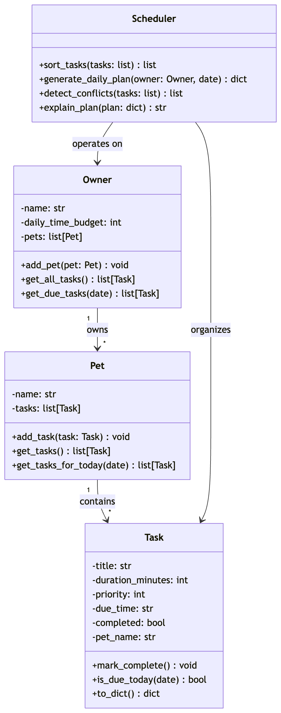
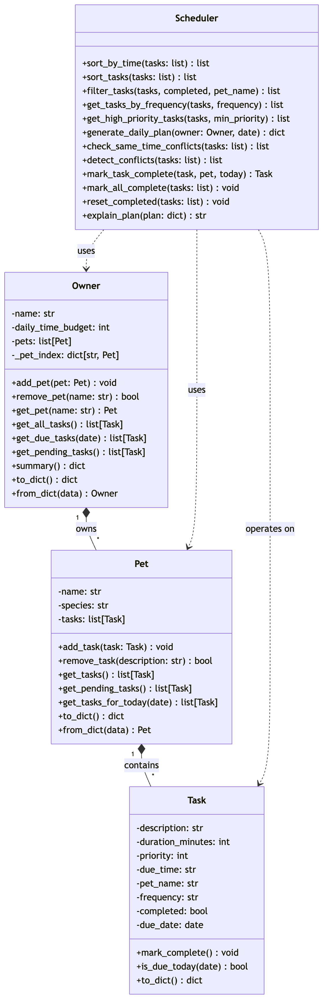

# PawPal+ Project Reflection

## 1. System Design

Register and manage pets
Create, view, and update pet profiles (name, species, age). This establishes the primary entity container for all subsequent task management.

Create and manage care tasks
Add, edit, and remove tasks tied to a specific pet with attributes such as duration, priority, due time, and recurrence. This forms the input space for the scheduling system.

Generate and review the daily care plan
Compute a prioritized schedule based on constraints (time budget, priority, deadlines), display selected vs skipped tasks, and provide an explanation of scheduling decisions.

1. Task
    Core unit of work.

    Attributes

    title
    duration_minutes
    priority
    due_time
    completed
    pet_name

    Methods

    mark_complete()
    is_due_today(date)
    to_dict()

2. Pet
    Container for tasks.

    Attributes

    name
    tasks

    Methods

    add_task(task)
    get_tasks()
    get_tasks_for_today(date)

3. Owner

    Container for pets.

    Attributes

    name
    daily_time_budget
    pets

    Methods

    add_pet(pet)
    get_all_tasks()
    get_due_tasks(date)

4. Scheduler

    Core logic.

    Attributes

    none required (stateless)

    Methods

    sort_tasks(tasks)
    generate_daily_plan(owner, date)
    detect_conflicts(tasks)
    explain_plan(plan)

Mermaid.js:

classDiagram
    class Owner {
        -name: str
        -daily_time_budget: int
        -pets: list[Pet]
        -_pet_index: dict[str, Pet]
        +add_pet(pet: Pet) void
        +remove_pet(name: str) bool
        +get_pet(name: str) Pet
        +get_all_tasks() list[Task]
        +get_due_tasks(date) list[Task]
        +get_pending_tasks() list[Task]
        +summary() dict
        +to_dict() dict
        +from_dict(data) Owner
    }

    class Pet {
        -name: str
        -species: str
        -tasks: list[Task]
        +add_task(task: Task) void
        +remove_task(description: str) bool
        +get_tasks() list[Task]
        +get_pending_tasks() list[Task]
        +get_tasks_for_today(date) list[Task]
        +to_dict() dict
        +from_dict(data) Pet
    }

    class Task {
        -description: str
        -duration_minutes: int
        -priority: int
        -due_time: str
        -pet_name: str
        -frequency: str
        -completed: bool
        -due_date: date
        +mark_complete() void
        +is_due_today(date) bool
        +to_dict() dict
    }

    class Scheduler {
        +sort_by_time(tasks: list) list
        +sort_tasks(tasks: list) list
        +filter_tasks(tasks, completed, pet_name) list
        +get_tasks_by_frequency(tasks, frequency) list
        +get_high_priority_tasks(tasks, min_priority) list
        +generate_daily_plan(owner: Owner, date) dict
        +check_same_time_conflicts(tasks: list) list
        +detect_conflicts(tasks: list) list
        +mark_task_complete(task, pet, today) Task
        +mark_all_complete(tasks: list) void
        +reset_completed(tasks: list) void
        +explain_plan(plan: dict) str
    }

    Owner "1" *-- "*" Pet : owns
    Pet "1" *-- "*" Task : contains
    Scheduler ..> Owner : uses
    Scheduler ..> Pet : uses
    Scheduler ..> Task : operates on

**Initial UML**

**Final UML**

**a. Initial design**

- Briefly describe your initial UML design.
    The design follows a layered object model where data ownership flows from Owner → Pet → Task, and a separate Scheduler class handles all decision-making logic. This separation keeps data storage independent from scheduling behavior.

- What classes did you include, and what responsibilities did you assign to each?
    The system is built around a few simple classes, each with a clear role.

    `Owner` represents the user. It keeps track of all the pets and stores things like how much time the user has available in a day. Its main job is to give a combined view of all tasks across pets so the system can plan the day.

    `Pet` represents an individual animal. It acts as a container for tasks related to that pet. It handles adding and retrieving tasks, keeping everything organized per pet instead of mixing tasks together.

    `Task` is the smallest unit in the system. It represents a single activity like feeding or a walk. It stores details such as duration, priority, and due time, and it can update its own status when completed.

    `Scheduler` is the decision-making part of the system. It takes all the tasks from the owner, sorts and prioritizes them, checks for conflicts, and builds a daily plan based on the available time. It also explains why certain tasks were selected or skipped.

    Each class has one clear responsibility, which keeps the system simple and easy to extend.

**b. Design changes**

- Did your design change during implementation?

        Yes, the design changed in two ways during implementation.

- If yes, describe at least one change and why you made it.

    **Change 1 — `Pet.add_task()` gained a consistency guard**
    The original design stored `pet_name` as a plain string on `Task`, with no enforcement that it matched the `Pet` it was being added to. During implementation it became clear that a task could silently end up in the wrong pet's list while still displaying the wrong name — a data inconsistency with no error signal. To fix this, `add_task()` was updated to raise a `ValueError` if `task.pet_name` does not match `self.name`. This was not part of the original UML but became necessary once the method was actually written.

    **Change 2 — `generate_daily_plan` returns more fields than originally planned**
    The original spec said the plan dictionary should contain scheduled and skipped tasks. During implementation of `explain_plan`, it became clear that the explanation also needed `time_used`, `time_budget`, and `date` to produce a meaningful summary. Without those fields, `explain_plan` would have needed to accept `owner` as a second argument, breaking its stated signature. Adding those three keys to the plan dictionary kept `explain_plan` self-contained and decoupled from `Owner`.

---

## 2. Scheduling Logic and Tradeoffs

**a. Constraints and priorities**

- What constraints does your scheduler consider (for example: time, priority, preferences)?

    The scheduler works with three main constraints when building a daily plan. The hardest limit is **time** — every owner has a `daily_time_budget` in minutes, and the scheduler stops adding tasks the moment the next one would push past that ceiling. The second constraint is **priority** — each task carries a numeric priority value, and higher-priority tasks are always scheduled first so they're never crowded out by less important ones. The third is **timing** — tasks have a `due_time` like `"08:00"`, and when two tasks share the same priority, the earlier one goes first. There's also a softer fourth constraint: **duration** — if priority and time are both tied, shorter tasks get preference so more tasks can fit within the budget. The scheduler also skips tasks already marked **completed** and raises a warning if any high-priority task (priority ≥ 4) ends up getting dropped due to time running out.

- How did you decide which constraints mattered most?

    Time came first because it's a hard wall — no matter how important a task is, you can't do it if the time simply isn't there. Priority came second because the whole point of a scheduler is making sure the things that matter most actually happen, not just the ones that appear first in a list. Due time was third, acting as a natural tiebreaker — it makes sense that a morning walk at 7:00 should come before a grooming session at 14:00. Duration was last, used only as a final tiebreaker to quietly squeeze more tasks in when everything else is equal. That ordering mirrors how a real person would think: *do I have time for this? Is it important? When is it due? How long will it take?*

**b. Tradeoffs**

- Describe one tradeoff your scheduler makes.

    The scheduler uses a **greedy approach** — it goes through the sorted task list from top to bottom and adds each task to the plan as long as there is still time left. Once a task doesn't fit, it is skipped, and the scheduler moves on. It does not look ahead or try different combinations to find a better fit. For example, if a 90-minute task fills up the remaining budget, two smaller 30-minute tasks that could have both fit will be skipped, even though they would have been a better use of the time.

- Why is that tradeoff reasonable for this scenario?

    For a daily pet care app, finding the mathematically perfect schedule is less important than being fast and predictable. A greedy scheduler runs instantly even with many tasks, and it always produces the same result for the same input — which makes it easy for the owner to understand and trust. Since tasks are already sorted by priority before the greedy pass runs, the most important tasks always get considered first, which means the plan is good enough in practice even if it isn't theoretically optimal.

---

## 3. AI Collaboration

**a. How you used AI**

I used AI throughout the whole project. Early on I used it for brainstorming — things like "what should the Scheduler class be responsible for?" or "should conflict detection live in Scheduler or Pet?" It helped get a first draft of ideas down fast. Later I used it more for debugging and refactoring, like asking why a test was failing or how to clean up a method that was getting too long.

The most useful prompts were specific and concrete. Instead of "help me with scheduling," something like "here's my `generate_daily_plan` method — why does it skip tasks even when there's time left?" got a much better answer. Asking AI to explain *why* something worked, not just fix it, was also helpful for actually learning from it.

**b. Judgment and verification**

One moment that stood out: AI suggested making `Scheduler` a class with state — storing the owner and date as instance variables. I didn't go with that because the whole point of `Scheduler` was to be stateless and reusable. I verified this by thinking through what would happen if the same scheduler object was used for two different owners — the state would leak between calls. I kept `Scheduler` stateless and passed the owner and date as arguments to each method instead.

---

## 4. Testing and Verification

**a. What you tested**

I tested the core behaviors: marking tasks complete, checking if a task is due today (for daily, weekly, and once-off tasks), adding tasks to pets, generating the daily plan, and detecting time conflicts. I also tested edge cases like what happens when the time budget is zero, or when all tasks are already completed.

These tests mattered because the scheduler's whole job is to make the right call about which tasks to include. If the priority sorting or time budget logic is off, the plan it produces is wrong — and you'd never know without a test to catch it.

**b. Confidence**

Pretty confident for the normal cases — the tests cover the main paths well. That said, I'd want to test a few more edge cases given more time: what happens with tasks that have the same priority *and* the same due time, whether weekly tasks work correctly across a week boundary, and how the system handles a large number of tasks where the greedy approach might leave a lot of time unused.

---

## 5. Reflection

**a. What went well**

The class separation turned out really well. Keeping `Scheduler` completely separate from `Owner`, `Pet`, and `Task` meant I could change the scheduling logic without touching anything else. That made debugging much easier — when something was wrong with the plan, I knew exactly where to look.

**b. What you would improve**

The greedy scheduler works, but it's not always the best fit. I'd redesign it to at least try a simple backtracking approach — so instead of just skipping a task that's too long, it checks if smaller lower-priority tasks could fill the remaining time better. I'd also add the ability to reschedule skipped tasks to the next available day rather than just dropping them.

**c. Key takeaway**

The biggest thing I learned is that AI is most useful when you stay in charge of the design decisions. It's great at filling in details and catching mistakes, but if you just ask it to build the whole thing, you end up with code you don't fully understand. The moments where I pushed back on AI suggestions — like keeping `Scheduler` stateless — were the moments I actually learned something.

Reflect on AI Strategy: Specifically describe your experience with VS Code Copilot:

The most effective Copilot features were inline completions and the chat panel. Inline completions were great for boilerplate — things like `to_dict()` and `from_dict()` methods that follow a clear pattern. Once it saw the first one, it could basically write the rest. The chat panel was more useful for design questions, like talking through how `generate_daily_plan` should structure its return value or why a test was behaving unexpectedly.

One example of a suggestion I rejected: Copilot proposed adding an `owner` parameter to `explain_plan` so it could pull the time budget directly from the owner object. I modified it to instead expect the plan dictionary to already contain `time_budget` and `time_used`. This kept `explain_plan` self-contained — it doesn't need to know anything about `Owner` to do its job, which made the method easier to test and reuse.

Using separate chat sessions for different phases helped a lot with staying focused. When I was in the design phase, I didn't want debugging suggestions cluttering the conversation, and vice versa. Each session had a clear purpose — one for UML and class design, one for implementing the scheduler logic, one for writing tests. It also made it easier to go back and reference what was discussed in each phase without scrolling through a long mixed thread.

The biggest thing I learned about being the "lead architect" is that you have to come in with a clear intent before asking AI anything. If you know what you want the system to do and why, you can evaluate AI suggestions against that — and push back when something doesn't fit. If you don't have that clarity, it's easy to just accept whatever the AI gives you and end up with a system that works but that you can't explain or extend. AI is a fast executor, not a designer. The design decisions still have to come from you.